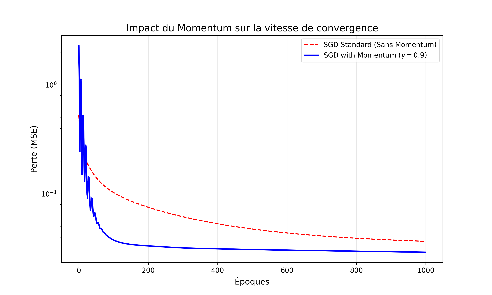

#  Mecheter Ines- Étudiante en Master 1 Intelligence Artificielle.

#  The Island Explorer : MLP from Scratch

Ce projet consiste en l'implémentation d'un **Perceptron Multicouche (MLP)** à partir de zéro, en utilisant uniquement **NumPy**, pour approximer une surface topographique complexe (une île) définie par une fonction mathématique non-linéaire.

##  Description du Projet
L'objectif principal est de démontrer la capacité d'un réseau de neurones artificiels à apprendre et à reconstruire des formes géométriques complexes. Le modèle prend en entrée des coordonnées $(x, y)$ et prédit l'altitude $z$ correspondante.

###  Fonctionnalités clés :
* **Architecture Flexible** : Configuration personnalisée du nombre de couches cachées et de neurones par couche.
* **Optimisation Momentum** : Implémentation du Gradient Descent avec Momentum pour stabiliser et accélérer la convergence.
* **Initialisation de He** : Utilisation de l'initialisation $w \sim \mathcal{N}(0, \sqrt{2/n_{in}})$ pour optimiser l'apprentissage avec l'activation ReLU.
* **Visualisation 3D** : Comparaison graphique entre la fonction cible (Ground Truth) et les prédictions du modèle.

##  Installation et Utilisation

1.  **Cloner le dépôt :**
    ```bash
    git clone [Dépôt GitHub du projet MLP](https://github.com/inesmch635-lang/MLP.git)
    cd MLP
    ```
2.  **Installer les dépendances :**
    ```bash
    pip install numpy matplotlib
    ```
3.  **Lancer l'entraînement :**
    ```bash
    python tp.py
    ```

##  Résultats d'Optimisation
L'ajout du terme de **Momentum** ($\gamma=0.9$) a permis de réduire considérablement les oscillations lors de la mise à jour des poids, permettant au modèle d'atteindre un MSE (Mean Squared Error) minimal beaucoup plus rapidement qu'une descente de gradient standard.

| Paramètre | Configuration |
| :--- | :--- |
| **Architecture du réseau** | [2, 64, 64, 1] |
| **Fonction d'activation** | ReLU (couches cachées) |
| **Optimiseur** | SGD + Momentum |
| **Nombre d'époques** | 1000 |
| **Learning Rate** | 0.01 |



##  Rapport Technique
Pour une analyse approfondie des hyperparamètres, de l'impact de la capacité du réseau et des démonstrations mathématiques, veuillez consulter le rapport complet :

 **[Consulter le Rapport Final (PDF)](./votre_nom_rapport.pdf)** 

